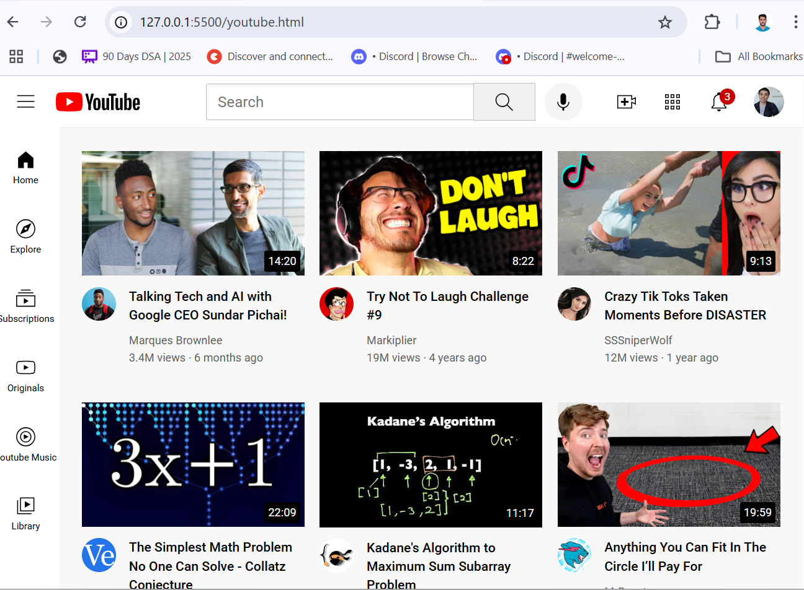

# HTML-CSS-BASICS

# YouTube Clone (HTML-CSS)

A basic static clone of the YouTube homepage built using  **HTML** and **CSS**. This project is non-responsive and focuses solely on layout and visual structure — great for beginners who are learning web development fundamentals.

## 🔍 Project Preview

 <!-- Replace with your image filename -->

## 📚 About the Project

This project is a clone of the YouTube homepage , created as part of learning HTML and CSS. It includes:

- Navigation bar with logo and icons
- Sidebar with navigation links
- Video thumbnail grid with titles and channel info

⚠️ This is a **non-responsive** layout intended for **desktop view only**.

## 🎯 Purpose

This was a learning project done by following along with supersimpledev. It helped me understand:

- CSS box model and layout
- Positioning and flexbox/grid basics
- Recreating real-world UI with code

## 🛠️ Technologies Used

- HTML5
- CSS3